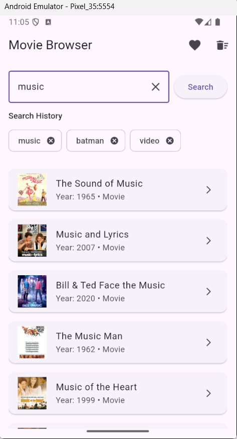

    

# 🎬 Movie Finder App

A Flutter application for searching movies using the OMDb API.

The app allows users to search for movies, view detailed information, and manage a list of favorite movies with local persistence.

Built as part of a Flutter technical assignment.

---
## 📚 Table of Contents

- [🎬 Movie Finder App](#-movie-finder-app)
  - [📚 Table of Contents](#-table-of-contents)
  - [📱 App Screenshot](#-app-screenshot)
  - [🚀 Getting Started](#-getting-started)
    - [Clone the repository](#clone-the-repository)
  - [🔑 Environment Variables](#-environment-variables)
    - [Setup Instructions:](#setup-instructions)
    - [Install dependencies](#install-dependencies)
    - [Run the app](#run-the-app)
  - [🛠 Technologies](#-technologies)
  - [🏗 Architecture](#-architecture)
  - [✨ Features](#-features)
    - [Cache Fallback Strategy](#cache-fallback-strategy)
  - [📂 Project Structure](#-project-structure)
  - [🔮 Possible Improvements](#-possible-improvements)
  - [📄 License](#-license)

---

## 📱 App Screenshot



---

## 🚀 Getting Started

### Clone the repository

```bash
git clone https://github.com/leahglang/movie_browser_flutter.git
cd movie_browser_flutter
```

---

## 🔑 Environment Variables

The project uses a `.env` file to manage sensitive configurations and API credentials. This ensures your keys are kept private and not pushed to version control.

### Setup Instructions:

1. **Create the file**: In the root directory of the project, create a new file named `.env`.
2. **Add your credentials**: Copy the following template and paste it into your `.env` file:

```env
BASE_URL=https://www.omdbapi.com
OMDB_API_KEY=your_api_key_here
```

### Install dependencies

```bash
flutter pub get
```

### Run the app

```bash
flutter run
```

---

## 🛠 Technologies

* Flutter
* Dart
* flutter_bloc (BLoC / Cubit)
* Dio
* Hive
* intl (localization)
* OMDb API

The project follows **Clean Architecture** principles with separated UI, state management, and data layers.

---

## 🏗 Architecture

The project follows a simplified Clean Architecture approach:

- UI layer (screens & widgets)
- State management (BLoC / Cubit)
- Data layer (repositories)
- External services (Dio API client + Hive storage)

Repositories abstract the data sources and allow the BLoC layer
to remain independent from networking and persistence details.

---

## ✨ Features

* 🔎 Search movies by title
* 📄 Paginated search results
* 🕘 Search history (stored locally)
* 🎞 View movie details
* 📡 Network fallback to cached movie details
* ⭐ Add / remove favorites
* 💾 Local persistence using Hive
* 🌍 Localization (English / Hebrew)
* ⚠️ Localized error handling
* ♿ Basic accessibility support

---

### Cache Fallback Strategy

When loading movie details the application first attempts to fetch
data from the OMDb API.

If the network request fails, the app will attempt to load the last
saved movie details from Hive (if they were previously fetched).

---

## 📂 Project Structure

```
 ├── assets/
 │   └── lang/          # localization files (JSON)
 ├── lib/
 │   ├── blocs/         # state management
 │   ├── models/        # data models
 │   ├── repositories/  # API & local data handling
 │   ├── screens/       # UI screens
 │   ├── widgets/       # reusable widgets
 │   └── core/          # utilities and localization
 ├── .env
```

---

## 🔮 Possible Improvements

All core requirements of the assignment were implemented, including movie search, pagination, favorites management, localization, error handling, and local persistence.

For the scope of this assignment, the focus was on delivering the required functionality with a clear architecture and clean code.  
The following aspects were not included:

* **Automated testing** – Unit and widget tests were not added due to the limited timeframe, although the current architecture (BLoC + repositories) was designed to make testing straightforward.
* **Advanced UI polish and animations** – The UI focuses on clarity and functionality rather than full production-level visual polish.
* **Extended caching strategy** – The application currently stores favorites and cached movie details locally. A production version could include more advanced caching strategies and cache invalidation.

These improvements would be natural next steps in a production-ready version of the application.

---

## 📄 License

This project is intended for **educational and demonstration purposes**.

